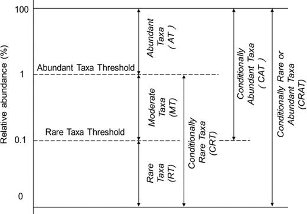

# atlas-utils之分析物种组成稀有度分布: rarity

### 一、atlas-utils rarity 介绍

**功能描述：**

`atlas-utils rarity`  根据物种丰度稀有度阈值 doi: [10.1093/femsec/fiw150](https://doi.org/10.1093/femsec/fiw150) 分析稀有度分布。

据图分类参考:

- 稀有物种 (rare taxa, RT)，在所有的样本中丰度均低于0.1%
- 丰富物种 (abundant taxa, AT)，在所有的样本中丰度均高于1%；
- 中等物种 (moderate taxa, MT)：
- 在所有样本中丰度在0.1%至1%之间；
- 条件稀有物种 (conditionally rare taxa, CRT)：
- 在所有样本中丰度均低于1%，同时在部分样本中丰度低于0.1%；
- 条件丰富物种 (conditionally abundant taxa, CAT)：
- 在所有样本中丰度均高于0.1%，同时在部分样本中丰度高于1%；
  条件稀有或丰富物种 (conditionally rare or abundant taxa, CRAT)：
- 在部分样本中的丰度在低于0.1%，同时在部分样本中的丰度高于1%。

更多可参考: 红皇后学术: [一条命令按照物种丰度对OTU表格进行拆分-丰富和稀有物种识别](https://mp.weixin.qq.com/s/FsYVPEvtB_ALfDWb_qGDbA) 

**命令行接口：**

    $ atlas-utils rarity
    
    Usage: atlas-utils  rarity [option] <tsv>
    
    Options:
      -n INT  normalization factor, ie: 100 default: [1]

**可选参数：**

      -n 整型   标准化因数，默认为1；

### 二、使用场景实例及其用法

**示例演示：**

**示例文件：**

    $ cat genus.freqs.txt | head -n 5

    #level  A-1     A-2     B-1     B-2     C-1     C-2
    Parvibaculum    0.0003635       0.0002873       5.318e-05       0       0.004845        0.004367
    Agromyces       0       0       0       0       0.009585        0.0114
    Pigmentiphaga   0.0001091       0.0001642       0.002765        0.001841        5.209e-05       0
    Mangrovibacterium       0       0       0.002499        0.001785        0       0

    $ cat  zotu.freqs.txt | head -n 5

    #OTU ID A-1     A-2     B-1     B-2     C-1     C-2
    ZOTU_1  0       0       0.004627        0.01551 0.09528 0.1079
    ZOTU_2  0.008106        0.01835 0.06743 0.08831 0.002709        0.002064
    ZOTU_3  0       0       0.008615        0.00887 0.05814 0.06045
    ZOTU_4  0       0       0.005265        0.002789        0.06512 0.06497

**运行命令：**

物种丰度稀有度阈值 分析稀有度分布

    $ atlas-utils  rarity -n 1  zotu.freqs.txt | head

    #OTU ID A-1     A-2     B-1     B-2     C-1     C-2     Type
    ZOTU_2  0.008106        0.01835 0.06743 0.08831 0.002709        0.002064        RT
    ZOTU_3  0       0       0.008615        0.00887 0.05814 0.06045 RT
    ZOTU_4  0       0       0.005265        0.002789        0.06512 0.06497 RT
    ZOTU_5  0       0       5.318e-05       0.0004463       0.06335 0.0641  RT
    ZOTU_6  3.635e-05       8.211e-05       0.0004786       0.0008926       0.06017 0.05797 RT
    ZOTU_7  0       0       0.003882        0.002287        0.05439 0.05633 RT
    ZOTU_8  0       0       0.07195 0.06867 0.0001042       2.991e-05       RT
    ZOTU_9  0       0       0.06233 0.05701 5.209e-05       5.983e-05       RT
    ZOTU_10 0       0       0       0       0.04631 0.04936 RT

`注意事项`: 如果加和为1, 需要乘`100` 作为标准化因子。

本文材料为 **BASE** (**B**iostack **A**pplied bioinformatic **SE**ies ) 课程 **Linux Command Line Tools for Life Scientists** 材料， 版权归 **上海逻捷信息科技有限公司** 所有。

Last Update: 2020-09-11 11:56 AM